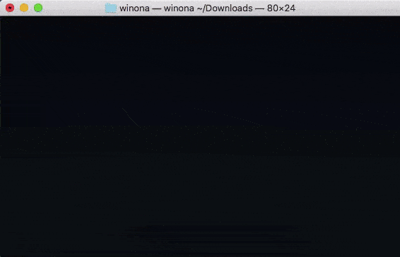

# winona
An ncurses-based command-line music player with no external dependencies! (´｡• ω •｡`)




## USAGE (・_・)ノ
```
./winona              #shuffles songs from current directory
./winona <directory>  #shuffles songs from specified directory
```

## BUILDING ( ^▽^)ψ
```
make
```
Basically we need to compile and link all the files in this directory, and also link `ncurses`. On some systems this is really self explanatory, e.g. on MacOS (and I presume BSDs):
`g++ winona.cpp -lncurses -Ilibraries -Wall -Wextra -o winona`.
However, it seems that on Linux we need to add a couple of extra flags:
`g++ winona.cpp -lncurses -ldl -pthread -Ilibraries -Wall -Wextra -o winona`.

This weirdness is (TODO) accounted for in the Makefile.

## DEPENDENCIES & COMPATABILITY ʕ •ᴥ• ʔ
This program supports any environment containing `dirent.h`, `ncurses.h`, and a `c++` compiler. For better or for worse, this excludes Windoze (because `dirent.h` is a library for Unix-like systems). However, the underlying audio libraries from [David Reid](https://github.com/mackron) (awesome guy) support basically any platform.

You almost certainly already have `ncurses`, but if not you can download it using your system's package manager. (The package name varies, check [here](https://www.cyberciti.biz/faq/linux-install-ncurses-library-headers-on-debian-ubuntu-centos-fedora/) for detailed instructions).

## THANKS (⊃｡•́‿•̀｡)⊃
Thanks to [David Reid](https://github.com/mackron) for making his audio decoders ([dr_libs](https://github.com/mackron/dr_libs)) and audio playback library ([miniaudio](https://github.com/mackron/miniaudio)) available -- this project would not be possible without them.
